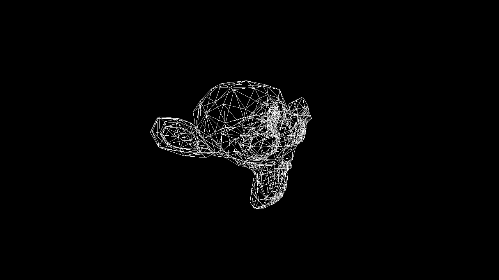

# Wireframe-STL-Renderer
This Wireframe Renderer was created as a part of a Computer Graphics course for the study Applied Computer Science at the Rotterdam University of Applied Sciences.
This Wireframe Renderer will render a wireframe image of Susan, the monkey head from Blender, but the program can render any binary .stl file. Loading an .stl file was not originaly part of this assignment, but I was intrested in trying if I could write some code to import an .stl file.

The image will be rendered as a file called "output.bmp".

<h3>Example Image</h3>

